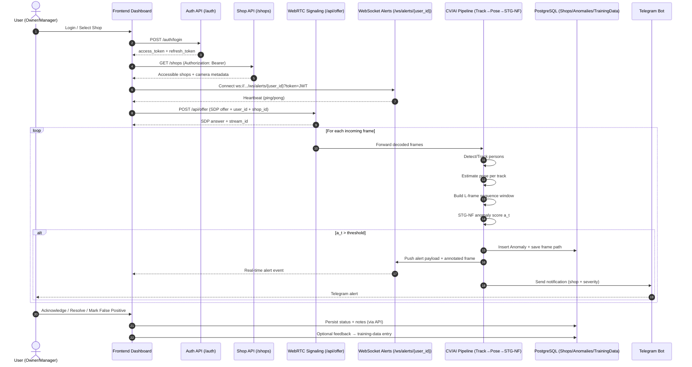
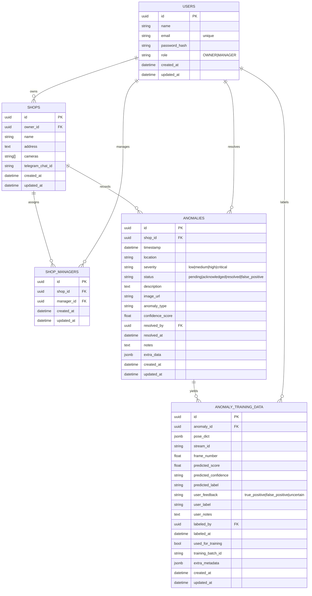

% ==================== Chapter 5 ====================
\chapter{System Design \& Architecture}

This chapter specifies the system architecture of VisionGuard.ai at the design level: how visual signals are transformed into structured evidence and actionable alerts, how components exchange information, and how the database persists incidents for audit and feedback. The emphasis is on an end-to-end surveillance intelligence workflow that remains practical under SME constraints (continuous streams, multiple shops, limited compute, and low tolerance for false alarms).

\section{Methodological Structure}
\subsection{Overall System Structure (Methodology-Only)}
The methodological structure is defined as a staged transformation from raw frames to decisions. Each stage reduces uncertainty while enforcing constraints on latency, privacy, and operational usability.

\begin{enumerate}
\item \textbf{Acquisition and segmentation:} video frames are sampled from one or more CCTV feeds. The stream is treated as a sequence $\{I_t\}_{t\ge 0}$, and processing is performed in short contiguous segments to preserve real-time behavior.

\item \textbf{Person-centric region extraction:} candidate humans are localized and cropped to reduce background clutter and focus subsequent processing on the subject of interest.

\item \textbf{Identity-consistent tracking:} detected persons are associated across time to form trajectories. This produces tracklets $\mathcal{T}_k = \{b_t, t\}$ that maintain temporal continuity even under partial occlusion or re-entries.

\item \textbf{Pose abstraction:} for each tracked person, skeletal keypoints are estimated to obtain a compact representation $\mathbf{P}_t \in \mathbb{R}^{J\times d}$ (with $J$ joints and $d\in\{2,3\}$ spatial dimensions). This step supports robustness to lighting variations and reduces reliance on appearance.

\item \textbf{Temporal windowing:} poses are buffered into fixed-length sequences $\mathbf{S}_t = (\mathbf{P}_{t-L+1},\dots,\mathbf{P}_t)$ of length $L$ (e.g., 24 frames). Windowing enables sequence-level inference that captures motion patterns rather than isolated postures.

\item \textbf{Spatio-temporal anomaly scoring:} a learned model computes an anomaly score $a_t = f(\mathbf{S}_t)$, where higher values indicate lower conformity to normal behavior patterns. In VisionGuard.ai, this stage is realized by STG-NF (Spatio-Temporal Graph Neural Network with Normalizing Flow), which is compatible with pose graphs and likelihood-based scoring.

\item \textbf{Decision and evidence packaging:} a decision rule compares $a_t$ against a threshold $\tau$. If $a_t > \tau$, an incident is instantiated with (i) timestamp and shop context, (ii) severity estimate, and (iii) a supporting frame snapshot and structured metadata.

\item \textbf{Alerting and human validation:} incidents are dispatched to operators (e.g., Telegram notifications and dashboard alerts). Acknowledge/resolve/false-positive actions provide supervisory signals that can be retained for later improvement.
\end{enumerate}

\subsection{Special Operating Mode: Owl-Eye (After-Hours)}
In after-hours operation, the system is expected to adopt a conservative rule structure: the presence of a person in restricted time windows is itself treated as suspicious. This mode reduces dependence on nuanced action classification and emphasizes reliable detection, persistence, and immediate alerting.

\section{High-Level Architecture Diagram}
This section provides the report placeholder for the main system overview diagram (CCTV frames $\rightarrow$ person cropping $\rightarrow$ tracking $\rightarrow$ pose $\rightarrow$ STG-NF scoring $\rightarrow$ alerts and storage). You can replace the placeholder with your final exported figure.

\begin{figure}[h]
\centering
\fbox{\parbox{0.92\linewidth}{\centering
\vspace{0.8cm}
\textbf{[PLACEHOLDER: High-Level Architecture Diagram]}\\
CCTV/Stream Frames $\rightarrow$ Person Cropping $\rightarrow$ Tracking $\rightarrow$ Pose Estimation $\rightarrow$\
Pose Windowing $\rightarrow$ STG-NF Anomaly Score $\rightarrow$ (DB Storage + Alerts)
\vspace{0.8cm}
}}
\caption{High-level pipeline of VisionGuard.ai from stream frames to anomaly alerts.}
\label{fig:vg_high_level_architecture}
\end{figure}

\section{Module Interaction Diagram}
The following Mermaid sequence diagram can be pasted into a diagram tool that supports Mermaid (or a Markdown renderer) to export an image and insert it into the report.

\section{Database Schema / ER Diagram}
The database schema is designed around (i) multi-tenant shop ownership and manager assignment, (ii) anomaly/event persistence for audit, and (iii) optional feedback storage for continuous improvement. The Mermaid ER diagram below matches the core backend models.

\section{Interface Specifications / API Contracts}
This section defines the external interfaces exposed by the backend. The contracts below are written to be implementation-faithful while remaining concise for report usage.

\subsection{Authentication and Identity}
\begin{table}[h]
\centering
\caption{Authentication API contracts.}
\label{tab:api_auth}
\begin{tabular}{|p{3.0cm}|p{5.0cm}|p{3.2cm}|p{4.2cm}|}
\hline
\textbf{Endpoint} & \textbf{Purpose} & \textbf{Auth} & \textbf{Key Fields} \\
\hline
POST /auth/register-owner & Create OWNER account & None & name, email, password \rightarrow tokens + user \\
\hline
POST /auth/register-manager & Create MANAGER account & None & name, email, password \rightarrow tokens + user \\
\hline
POST /auth/login & Authenticate user & None & email, password \rightarrow tokens + user \\
\hline
GET /auth/me & Fetch current user profile & Bearer JWT & returns id, name, email, role \\
\hline
POST /auth/logout & Client-side logout marker & Bearer JWT & returns success message \\
\hline
\end{tabular}
\end{table}

\subsection{Shop Management (Multi-Tenant Access)}
\begin{table}[h]
\centering
\caption{Shop management API contracts.}
\label{tab:api_shops}
\begin{tabular}{|p{3.0cm}|p{5.0cm}|p{3.2cm}|p{4.2cm}|}
\hline
\textbf{Endpoint} & \textbf{Purpose} & \textbf{Auth} & \textbf{Key Fields} \\
\hline
POST /shops & Create shop and assign managers & OWNER only & name, address, cameras[], assigned\_manager\_emails[] \\
\hline
GET /shops & List accessible shops & Bearer JWT & OWNER: owned shops; MANAGER: assigned shops \\
\hline
GET /shops/{shop\_id} & Retrieve shop detail & Bearer JWT + access & shop metadata + managers \\
\hline
PUT /shops/{shop\_id} & Update shop & OWNER only & name/address/cameras + manager reassignment \\
\hline
DELETE /shops/{shop\_id} & Delete shop & OWNER only & cascades assignments (and related data via FK) \\
\hline
GET /shops/{shop\_id}/managers & List managers for shop & Bearer JWT + access & returns manager list \\
\hline
POST /shops/check-manager-email & Verify manager email exists & Bearer JWT & email \rightarrow {exists, email} \\
\hline
\end{tabular}
\end{table}

\subsection{Anomalies (Incidents, Evidence, Status)}
\begin{table}[h]
\centering
\caption{Anomaly API contracts.}
\label{tab:api_anomalies}
\begin{tabular}{|p{3.3cm}|p{4.7cm}|p{3.0cm}|p{4.4cm}|}
\hline
\textbf{Endpoint} & \textbf{Purpose} & \textbf{Auth} & \textbf{Key Fields} \\
\hline
GET /api/anomalies & List anomalies (paged) & Bearer JWT & filters: shop\_id, status, severity, limit, offset \\
\hline
GET /api/anomalies/{anomaly\_id} & Get anomaly details & Bearer JWT & returns incident + evidence URL \\
\hline
PATCH /api/anomalies/{anomaly\_id} & Update status/notes & Bearer JWT (OWNER/MANAGER) & status + notes; sets resolved\_by/resolved\_at \\
\hline
GET /api/anomalies/frames/{shop\_id}/{filename} & Fetch stored frame & Bearer JWT & returns image/jpeg (cacheable) \\
\hline
GET /api/anomalies/stats/summary & Summary stats & Bearer JWT & total + counts by status/severity + recent\_24h \\
\hline
\end{tabular}
\end{table}

\subsection{Real-Time Streaming and Alerts}
\begin{table}[h]
\centering
\caption{Streaming and real-time interfaces.}
\label{tab:api_realtime}
\begin{tabular}{|p{3.3cm}|p{4.7cm}|p{3.0cm}|p{4.4cm}|}
\hline
\textbf{Interface} & \textbf{Purpose} & \textbf{Auth} & \textbf{Key Fields} \\
\hline
POST /api/offer & WebRTC SDP exchange; starts stream & Bearer JWT & offer includes user\_id, shop\_id; response includes stream\_id \\
\hline
WS /ws/alerts/{user\_id}?token=JWT & Push alerts and frames & Token in query & ping/pong heartbeat; alert payload + base64 frame \\
\hline
GET /api/users & List active users (streams) & (admin/ops) & user list with stream counts \\
\hline
GET /api/users/{user\_id}/streams & List active streams for user & (admin/ops) & stream metadata + timestamps \\
\hline
DELETE /api/users/{user\_id}/streams/{stream\_id} & Close a stream & (admin/ops) & returns remaining stream count \\
\hline
DELETE /api/users/{user\_id} & Close all streams for user & (admin/ops) & terminates user session \\
\hline
GET /api/stats & Global stream statistics & (admin/ops) & total users/streams, capacity metrics \\
\hline
GET /api/health & Signaling service health & None & status + active connections \\
\hline
\end{tabular}
\end{table}

\subsection{Feedback and Training Data (Human-in-the-Loop)}
\begin{table}[h]
\centering
\caption{Training-data feedback API contracts.}
\label{tab:api_training_data}
\begin{tabular}{|p{3.3cm}|p{4.7cm}|p{3.0cm}|p{4.4cm}|}
\hline
\textbf{Endpoint} & \textbf{Purpose} & \textbf{Auth} & \textbf{Key Fields} \\
\hline
GET /api/training-data & List stored samples & Bearer JWT & filters: user\_feedback, used\_for\_training, limit, offset \\
\hline
PUT /api/training-data/{id}/feedback & Submit feedback & Bearer JWT & user\_feedback + optional user\_label/notes \\
\hline
GET /api/training-data/stats & Feedback statistics & Bearer JWT & counts by feedback category \\
\hline
\end{tabular}
\end{table}

\section{Security \& Performance Design}
\subsection{Security Design}
\begin{itemize}
\item \textbf{Authentication:} all protected HTTP endpoints require a Bearer JWT. Real-time alerts require a JWT token as a WebSocket query parameter and enforce a strict user-id match between token subject and URL path.
\item \textbf{Authorization (RBAC + shop scope):} access is scoped by role (OWNER/MANAGER) and by shop membership. Owners manage their own shops; managers are limited to shops assigned through the ShopManager relationship.
\item \textbf{Credential protection:} passwords are stored as hashes (never plaintext). Tokens are short-lived access tokens with refresh tokens to reduce exposure.
\item \textbf{Evidence access control:} anomaly frames are served behind authentication to prevent public exposure of sensitive footage.
\item \textbf{Auditability:} anomaly status transitions (pending/acknowledged/resolved/false-positive) and resolution notes support post-incident review and accountability.
\end{itemize}

\subsection{Performance and Reliability Design}
\begin{itemize}
\item \textbf{Compute placement:} the design prioritizes a lightweight, modular pipeline and concentrates server-side learning-based inference at the sequence-level anomaly scoring stage, supporting a CPU-centric cost profile.
\item \textbf{Windowed inference:} fixed-length pose windows enable bounded computation per decision and stable latency (no unbounded temporal context).
\item \textbf{Asynchronous alerting:} alerts are pushed via WebSockets (low latency) and mirrored to Telegram (high reach) without blocking the main processing loop.
\item \textbf{Backpressure and connection health:} WebSocket heartbeat (ping/pong) detects stale clients; stream/session endpoints support explicit cleanup to avoid resource leaks.
\item \textbf{Database efficiency:} pagination (limit/offset) and targeted indexes (e.g., by shop\_id, timestamp, severity/status) support scalable incident retrieval and dashboards.
\end{itemize}
